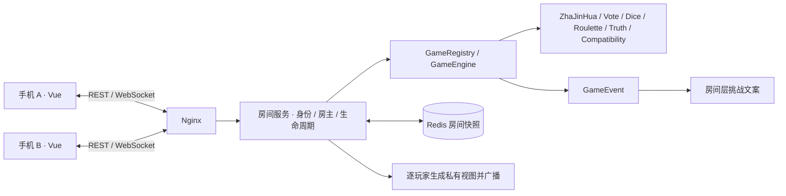

# 酒玩 JIUWAN

**今晚，玩点不一样的。**

一个移动端优先的多人聚会游戏平台。朋友聚会、KTV、饭后、团建、宿舍里，打开浏览器，输入同一个 6 位房间码就能一起玩。无需账号、无需下载，没有支付和真钱下注。

已实现：炸金花、匿名投票、真心话 / 大冒险、幸运轮盘、摇骰子、默契测试。六个游戏共享同一房间和玩家身份，房主可随时结束当前游戏并切换玩法。

## 快速启动（推荐 Docker）

需要 Docker Engine / Docker Desktop 与 Compose v2。在项目根目录执行：

```bash
docker compose up -d --build
```

首次构建会下载 Java、Node、Maven 依赖。完成后打开 **http://localhost:8088**。

```bash
docker compose ps                 # 三个服务应为 healthy
docker compose logs -f backend    # 后端日志
docker compose down              # 停止；保留 Redis 数据卷
```

已有镜像后可直接 `docker compose up -d`。修改代码后使用 `--build`。

### 两台手机一起玩

1. 手机和运行项目的电脑连接同一个 Wi-Fi。
2. 查看电脑局域网 IP，例如 `192.168.1.23`。
3. 两部手机都打开 `http://192.168.1.23:8088`，允许系统防火墙访问 8088 端口。
4. A 创建房间，填写昵称并进入；B 输入房间码加入。
5. A 选择游戏并开始，双方自动进入同一局。刷新或恢复网络后会重连。

**OrbStack 仅开放 localhost 的情况：** 如果电脑能访问 localhost，但 Wi-Fi IP 连接被拒绝，可在项目根目录另开终端运行项目自带的局域网入口：

```bash
LAN_HOST=192.168.1.23 node scripts/lan-proxy.mjs
```

把 IP 替换为本机 Wi-Fi 地址（macOS 可用 `ipconfig getifaddr en0` 查看）。该进程只将「酒玩」的 8088 端口从指定 Wi-Fi 地址转发到本机容器入口，支持 HTTP 和 WebSocket；需要持续运行，Ctrl+C 停止。自定义端口时同时设置 `FRONTEND_PORT`。本次开发机的 OrbStack `docker.expose_ports_to_lan` 为 false，已使用此方式提供手机入口。相关设置见 [OrbStack 网络文档](https://docs.orbstack.dev/docker/network)。

Nginx 转发原始 Host，WebSocket 支持同源访问，所以同一入口的局域网地址无需逐台加入白名单。跨域入口可用 `ALLOWED_ORIGINS` 指定，逗号分隔，不使用通配符。手机通过 HTTP 开发环境也能生成请求 ID、复制邀请信息；安装 PWA / Service Worker 需要 HTTPS 或 localhost。

默认端口：前端 8088，Redis 仅本机 `127.0.0.1:16379`；Docker 后端不向宿主机暴露端口。可复制 `.env.example` 为 `.env` 修改配置。上线时在入口配置 HTTPS。

## 新增：炸金花 · 酒局心理战

- 2–17 人，一副 52 张牌，每人三张；看牌、闷牌跟注、加注、比牌、弃牌完整流程。
- 私密手牌、每次行动 30 秒、超时弃牌、每局轮换先手；下一局重新洗牌并重置积分。
- 豹子 > 顺金 > 金花 > 顺子 > 对子 > 散牌；QKA 最大顺子，A23 最小，同点数主动比牌者输。
- 房间设置可开启“非同花 235 吃豹子”，默认关闭；酒局模式默认每位输家 1 小口，可用饮料代替或跳过。
- 跟注、加注只使用每局虚拟积分，不增加饮酒量；底分最高 5，开局人数 ×5 次行动后只可比牌或弃牌。

规则来源、地方规则取舍及结算方式见 [炸金花规则](docs/zhajinhua-rules.md)。房间仍支持 20 人，炸金花只在在线人数不超过 17 时开局。

## 技术架构

- 前端：Vue 3、TypeScript strict、Vite、Pinia、Vue Router、Tailwind CSS、原生 WebSocket；无大型 UI 框架。
- 后端：Java 21、Spring Boot 3.5.16、Spring Web / WebSocket / Data Redis、Jackson、Lombok、Maven。
- 状态：服务端权威计算，Redis 保存整个房间快照。前端只发操作。
- 部署：Nginx + 单实例 Spring Boot + Redis 7.4，前后端同源代理。
- 游戏：Spring 自动注入 `List<GameEngine>`，`GameRegistry` 自动发现策略；前端按目录自动懒加载游戏组件。



## 目录结构

```text
jiuwan/
├── frontend/
│   ├── src/
│   │   ├── views/           首页、加入、昵称、大厅
│   │   ├── components/      游戏容器、玩家选择、弹窗、视觉组件
│   │   ├── stores/          user / room / game / websocket
│   │   ├── games/           每个游戏的 Game.vue、catalog、自动注册
│   │   └── lib/             类型、REST 请求、操作辅助
│   ├── public/              图标、manifest、离线页与 Service Worker
│   ├── tests/               Playwright 多人端到端测试
│   ├── nginx.conf
│   └── Dockerfile
├── backend/
│   ├── src/main/java/com/jiuwan/
│   │   ├── domain/          Room / Player / RoomSettings
│   │   ├── dto/             API / WebSocket 请求与安全的 RoomView
│   │   ├── controller/      REST 路由、统一异常处理
│   │   ├── service/         房间、身份、游戏编排、事件展示、定时维护
│   │   ├── game/            引擎接口、上下文、注册表、游戏状态与事件
│   │   │   └── impl/        六个引擎实现
│   │   ├── websocket/       连接绑定、鉴权、心跳、广播
│   │   ├── repository/      Redis 快照读写
│   │   └── config/          WebSocket 来源限制、请求限速
│   ├── src/main/resources/questions/   JSON 题库
│   ├── src/test/            后端业务测试
│   └── Dockerfile
├── docs/protocol.md         完整 WebSocket 协议与错误语义
├── scripts/                 真实协议检查、可选的局域网入口
├── docker-compose.yml
└── README.md
```

## 本地开发

需要 **JDK 21、Maven 3.9+、Node.js 22.12+（或 Node 24）、npm、Docker**。

### 1. 启动 Redis

```bash
docker compose up -d redis
```

### 2. 启动后端

确认 `java -version` / `mvn -version` 使用 Java 21。在独立终端运行：

```bash
cd backend
REDIS_PORT=16379 mvn spring-boot:run
```

后端监听 `http://localhost:8080`，健康检查 `http://localhost:8080/actuator/health`。

若使用自己的 Redis，可设置 `REDIS_HOST` 和 `REDIS_PORT`。无 Redis 时后端不会回退到模拟数据。请避免开发后端和 Docker 后端同时连接同一份 Redis 数据。

### 3. 启动前端

```bash
cd frontend
npm ci
npm run dev
```

打开 `http://localhost:5173`。Vite 监听所有网卡，`/api` 和 `/ws` 代理至本机 8080，手机可通过电脑 IP 的 5173 端口访问。

### 4. 构建和测试

```bash
cd backend
mvn test
mvn package

cd ../frontend
npm run build
npx playwright install chromium
npm run test:e2e
```

端到端测试要求 Redis、后端、Vite 已启动。验证 Docker 生产入口：

```bash
cd frontend
E2E_BASE_URL=http://localhost:8088 npm run test:e2e
```

后端测试覆盖房间创建 / 加入 / 容量、身份伪造、房主权限与转移、断线恢复、并发重复操作、陈旧局次、插件注册、投票保密与并列、超时结算、骰子两种规则、默契分、轮盘与真心话权限、题库数量。浏览器测试使用两个独立上下文，覆盖六款游戏、刷新、网络断开恢复、房主转移，以及 375 / 390 / 430 / 1440px 布局。

## 核心设计决策

### 房间与身份

- 创建房间先预留昵称“派对发起人”与玩家身份，再进入昵称页面；未完成昵称也可凭原身份刷新恢复。
- `playerId` 与 WebSocket session 无关。服务端生成 256-bit 随机 `playerToken`，浏览器存入 `localStorage`，Redis 只保存 SHA-256 摘要。
- Token 仅通过 REST 返回一次和 WebSocket `RECONNECT` 消息传输，不放在 URL、广播或日志中。
- 一个玩家同一时间使用一个活动连接；新连接替换旧连接，旧页面会明确显示提示。不同玩家应使用不同设备、浏览器或独立浏览器上下文。
- 昵称 1–16 字符，Emoji 固定白名单；房间容量默认 12，房主可设置 2–20。
- 进行中不接纳新身份加入；原身份可随时重连。明确退出或踢人会中止当前游戏并返回大厅，防止游戏等待已离场参与者。
- 正常离开即转移房主；断线保留 15 秒宽限，超时转给最早加入的在线玩家。无在线成员时保留待恢复的房主。
- `WAITING → PLAYING → FINISHED`，结束后可在同一房间继续开始任意游戏；关闭后 `CLOSED`。每轮拥有独立 `instanceId`。

### 权威状态、幂等与保密

`GameEngine` 接收操作，生成状态与事件。随机源使用服务端 `SecureRandom`。投票只在全部投完或 45 秒到期后公布统计；骰子 / 默契测试等限时 60 秒。开始前统一 3 秒倒计时，服务器拒绝提前提交。已过截止时间的操作也会拒绝，后台维护器负责结算。

每个房间的变更在进程内锁下完成：读快照 → 鉴权 → 校验 → 修改 → 写 Redis → 广播。`requestId` 按玩家在房间内去重，最多保留最近 256 个；引擎额外阻止一位玩家重复操作。`gameId + instanceId` 拒绝旧游戏或旧局的延迟操作。状态 `version` 单调递增，前端忽略旧版本。版本可能跳号（例如心跳更新），客户端接收的是完整快照，不依赖增量消息。

私有 `privateChoices` 从不直接序列化给客户端。`getPlayerView` 只加上当前玩家的 `myChoice` / `hasActed`。投票结束也不会泄露投票者对应关系，除非房间主动关闭匿名投票。默契测试若只有一个答案而超时，取消该轮并保持答案私密。炸金花的 `ZhaJinHuaState` 只保存在服务端。看牌前，自己的手牌也不会下发；看牌后只通过个人视图发送。结束时只公开未弃牌者的手牌，弃牌者的牌始终对他人保密。

### 事件与挑战分离

引擎只生成 `GameEvent`（胜者、败者、选中玩家、挑战玩家、全体玩家等）。`GameEventPresenter` 根据 `RoomSettings.punishmentMode` 生成“自选挑战 / 真心话 / 自选小任务”文案。引擎只记录酒局规则开关，饮酒文案仍由展示层生成。炸金花每局输家统一为 1 小口，虚拟积分不映射饮酒量。

默认安全模式开启，题库保持轻松。炸金花默认酒局模式：每位输家 1 小口，可换饮料或跳过；可在房间设置单独关闭酒局模式，改用房间挑战方式。其他游戏仍使用原挑战方式。所有挑战都可自愿跳过，由房主开始下一局。

### Redis 与运行边界

使用单个键 `jiuwan:room:{roomCode}` 保存 Room（含玩家、令牌摘要、设置、私有游戏状态、事件、去重记录），便于一次 `SET` 原子提交完整状态，不产生多个键 TTL 或更新不一致问题。房间人数很少，鉴权在最多 20 人中查找摘要，第一版无需额外 Token 索引。

- 未关闭房间 TTL 6 小时，合法操作 / 心跳刷新 TTL。
- 关闭后保留 15 分钟用于识别过期访问。
- 所有人离线 30 分钟后自动关闭；连接超过 65 秒未发心跳视为离线。
- Redis AOF 持久化与命名数据卷；启动时用 `SCAN` 恢复未关闭房间，将所有玩家标记离线，等待各自重新鉴权，保留本局状态。
- 单实例适合 MVP。**不能直接水平扩容多个后端共享同一份房间键**：扩容需要房间分区 / 分布式事务与 Redis Pub/Sub 广播。当前部署明确只启一个后端。
- Redis 设置 256 MB 上限与 `noeviction`，容量满时显式报错，不静默驱逐进行中的房间。

### 网络与移动体验

WebSocket 心跳每 20 秒一次；1 / 2 / 4 / 8 / 10 秒指数退避自动重连，成功后发送 `RECONNECT` 并恢复完整房间及个人视图。支持 `online`、`offline`、`visibilitychange`，用于锁屏、切后台和网络切换。等待中的操作若断线会提示检查最新状态，不会盲目重放。

提供移动大按钮、Emoji 头像、加入过渡、3 秒倒计时、投票结果动画、骰子动画、按服务器索引定位的轮盘动画、排行榜动画，并遵从减少动态效果的系统偏好。游戏组件懒加载。

PWA 使用 manifest、图标与离线提示页；动态 API、身份与游戏状态不写入 Service Worker 缓存。离线时不能继续计算游戏结果，恢复网络后重连。当前二维码入口按需求预留，第一版可复制链接或房间码邀请。

## REST API

统一成功响应：`{ "success": true, "data": ... }`。
统一失败响应：`{ "success": false, "error": { "code": "...", "message": "..." } }`。

| 方法 | 路径 | 请求 / 身份 | 返回 |
|---|---|---|---|
| POST | `/api/rooms` | `{ nickname, avatar }` | `roomCode, playerId, playerToken` |
| POST | `/api/rooms/{code}/join` | `{ nickname, avatar }` | 同上 |
| GET | `/api/rooms/{code}` | 无身份 | 仅房间状态 / 人数 / 容量 |
| GET | `/api/rooms/{code}` | `Authorization: Bearer <token>` | 当前玩家安全视图 |
| GET | `/api/games` | 无身份 | 已注册游戏列表 |
| POST | `/api/rooms/{code}/games/{gameId}/start` | Bearer token + `{ requestId }`，房主 | 开始并返回快照 |
| GET | `/actuator/health` | 无身份 | 服务及 Redis 健康状态 |

房间设置、踢人、结束游戏和游戏动作统一走 WebSocket。REST 按来源 IP 每分钟最多 120 次；WebSocket 每连接每秒最多 20 条、单条最多 8 KB，未鉴权连接会清理。

## WebSocket 协议

端点 `/ws`。先恢复身份，再发送动作：

```json
{"type":"RECONNECT","requestId":"unique-id","roomCode":"123456","playerToken":"token-from-create-or-join"}
```

```json
{
  "type": "GAME_ACTION",
  "requestId": "unique-id",
  "roomCode": "123456",
  "playerId": "optional-consistency-check",
  "gameId": "vote",
  "instanceId": "instance-from-current-game-view",
  "action": "VOTE",
  "data": { "targetPlayerId": "player-id" }
}
```

服务器返回版本化的完整快照，每个连接按绑定身份单独生成：

```json
{
  "type": "GAME_STATE_UPDATE",
  "roomCode": "123456",
  "gameId": "vote",
  "version": 18,
  "serverTime": 1789455600000,
  "data": {
    "roomCode": "123456",
    "status": "PLAYING",
    "version": 18,
    "players": [],
    "settings": {},
    "game": {
      "gameId": "vote",
      "instanceId": "current-round-instance",
      "round": 1,
      "complete": false,
      "hasActed": false,
      "submittedCount": 0
    },
    "events": []
  }
}
```

上方为裁剪示例；完整字段、动作、ACK、错误和重连约定见 [docs/protocol.md](docs/protocol.md)。

## 增加新游戏

以 `rock-paper-scissors` 为例：

1. 新建 `RockPaperScissorsGameEngine`，标注 `@Component`，实现 `GameEngine` 或继承 `AbstractGameEngine`。
2. 返回唯一 `gameId()` 与 `gameName()`；实现 `initialize` / `handleAction` / 超时处理。`AbstractGameEngine` 负责局次、倒计时、参与者快照与安全视图基础字段。
3. 私有选择放在 `GameState.privateChoices`；公开内容放在 `publicData`。不要把私有字段拷贝到公开视图。更复杂的牌类游戏可扩展独立的服务端状态类型和私有视图。
4. 引擎通过 `GameEvent` 报告结果。插件不会直接修改房主、成员或发送饮酒指令。
5. 新建 `frontend/src/games/rock-paper-scissors/Game.vue`，使用 `useGameStore` 读个人视图、`useAction` 发操作。
6. 在 `frontend/src/games/catalog.ts` 加一条卡片描述（新增界面字段时扩展 `GameView` 类型）。前端 `registry.ts` 自动发现对应目录，无需改路由或大厅渲染代码。
7. 添加引擎测试，运行后端测试和前端构建。

Spring `GameRegistry` 自动收集 Bean，重复 ID 会在启动时失败。无需修改核心服务的 `switch` 来增加普通游戏动作。

## 本版范围

已做真实 Redis、真实 WebSocket 和六款游戏；未使用本地假房间或浏览器生成结果。没有注册、支付、会员、聊天、语音、真钱游戏或管理后台。题库提供 32 道投票题、4 种模式各 20 道真心话和 20 道大冒险、20 道默契题。

当前目录原本不是 Git 仓库，因此未自行初始化或制造提交。所有代码和配置均保存在当前项目中。

## 验证与预览

完整验证记录与边界见 [docs/verification.md](docs/verification.md)。生产入口可额外执行 `node scripts/protocol-smoke.mjs` 验证真实权限、私密视图和重连。

前端代码格式：`cd frontend && npm run format:check`（修改后可执行 `npm run format`）。


