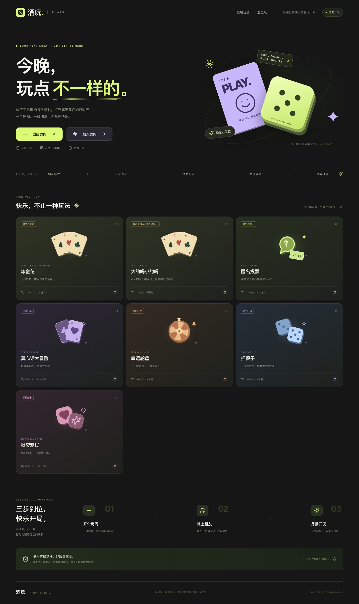

<h1 align="center">酒玩 · JIUWAN</h1>

<p align="center">
  <strong>多人聚会小游戏 · 今晚，玩点不一样的。</strong>
</p>

<p align="center">
  <a href="LICENSE"></a>
  
  
  
  
  
  
</p>

<p align="center">
  无需注册 · 无需下载 · 6 位房间码加入 · 手机电脑一起玩<br/>
  炸金花 · 大的喝小的喝 · 匿名投票 · 真心话 / 大冒险 · 幸运轮盘 · 摇骰子 · 默契测试
</p>

<div align="center">

[玩法介绍](#有什么好玩的) · [界面预览](#界面预览) · [快速开始](#自己部署和朋友一起玩) · [开发文档](docs/development.md)

</div>

---

## 关于酒玩

酒玩是一个给朋友聚会准备的多人小游戏网站。饭后不想散场、KTV 等歌的空档、宿舍夜聊或团建破冰，都可以开个房间，喊上朋友一起玩。

打开浏览器，输入同一个 **6 位房间码**，就能加入。无需注册，也不用安装 App。

## 有什么好玩的？

目前有七款游戏，从轻松破冰到手气对决，换个玩法就能接着玩。

| 游戏 | 怎么玩 |
| --- | --- |
| 🃏 **炸金花** | 每人三张牌，选择闷牌、看牌、跟注或比牌，拼手气也拼胆量。支持 2–17 人，使用每局重置的虚拟积分。 |
| 🙈 **大的喝小的喝** | 去掉大小王，每人随机发一张牌，只能看别人的。房主结束本轮后全部亮牌，不限时，玩法由大家约定，系统只负责发牌和亮牌。 |
| 🗳️ **匿名投票** | “谁最有可能……？”悄悄投出你的一票，一起揭晓大家心中的那个人。 |
| 💬 **真心话 / 大冒险** | 随机选一位朋友，抽一张真心话或大冒险卡，聊点平时没聊过的。 |
| 🎡 **幸运轮盘** | 转动轮盘，把下一轮的挑战交给运气决定。 |
| 🎲 **摇骰子** | 每人摇一次，揭晓点数和排名，看看这次谁的手气最好。 |
| 💞 **默契测试** | 随机配对的两位玩家分别选答案，揭晓时看看能不能想到一块儿。 |

## 为聚在一起的人设计

- **手机打开就能玩**：适配手机和桌面浏览器，大按钮、清晰牌面，围坐一桌也方便操作。
- **一个房间玩到底**：分享链接或房间码邀请朋友，结束一局后继续下一局，也能换个游戏。
- **最多 20 人同房**：房间默认容纳 12 人，房主可调整到 2–20 人；炸金花最多 17 人开局。
- **大家同步参与**：一起倒计时、一起揭晓结果；刷新页面或短暂断网后，恢复连接即可回到当前房间。
- **按朋友的喜好来**：房主可以调整题目模式、匿名投票和部分游戏规则。

所有挑战都可以自愿跳过。喝水、喝饮料也能参与，开心和舒服最重要。牌局积分只用于游戏，没有支付或真钱下注。

## 界面预览



更多截图：[手机首页](docs/screenshots/home-mobile.png) · [手机牌桌](docs/screenshots/zhajinhua-mobile.png) · [桌面牌桌](docs/screenshots/zhajinhua-desktop.png) · [牌局结算](docs/screenshots/zhajinhua-result.png)

大的喝小的喝：[手机牌桌](docs/screenshots/big-small-mobile.png) · [桌面牌桌](docs/screenshots/big-small-desktop.png) · [全部亮牌](docs/screenshots/big-small-revealed.png)

## 三步开玩

1. **开个房间**：一位朋友创建房间，填写昵称、选好头像。
2. **喊上朋友**：把邀请链接或 6 位房间码发给大家，各自在浏览器里加入。
3. **选个游戏**：房主选择玩法并开始，所有人一起进入游戏。

新朋友可以在大厅加入；游戏进行中，需要等这一局结束、回到大厅后再加入。

## 自己部署，和朋友一起玩

安装好 Docker 和 Docker Compose v2，下载或克隆本仓库，在项目根目录运行：

```bash
docker compose up -d --wait --wait-timeout 180
```

默认拉取 `latest` 前后端镜像，首次启动会下载镜像，完成后打开 **[http://localhost:8088](http://localhost:8088)**。无需本地安装 Java、Node.js 或配置镜像仓库账号。

已发布镜像支持 **Linux AMD64（x86_64）**。ARM 设备或需要修改代码时，可按 [开发文档](docs/development.md) 中的「从源码构建」章节使用本机架构构建镜像。

默认使用 Redis 保存房间，支持后端重启后恢复。镜像地址、端口等部署参数已写入根目录 `docker-compose.yaml`，直接运行上面的命令即可；需要调整时编辑该文件。更新与回退步骤见 [开发文档](docs/development.md) 中的「更新与回退」章节。

临时聚会也可以通过源码构建选择**纯内存模式，无需 Redis**。它支持正常游戏、刷新和断网重连，但**后端重启或更新后房间会清空**。构建命令、模式切换和容量配置见 [开发文档](docs/development.md) 中的「存储模式」章节。

想让手机一起加入：

1. 手机和运行项目的电脑连接同一个 Wi-Fi。
2. 查看电脑的局域网 IP，例如 `192.168.1.23`。
3. 大家在手机浏览器打开 `http://192.168.1.23:8088`，然后创建或加入房间。

端口配置、手机无法访问时的排查，以及本地开发步骤，见 [开发与部署](docs/development.md)。

## 了解更多

项目使用 **Vue 3 + TypeScript** 构建界面，**Spring Boot** 管理房间和游戏状态，可选 **Redis / 内存存储**，通过 **WebSocket** 同步多人操作，支持 Docker 部署。

- [开发与部署](docs/development.md)：运行项目、技术架构和添加新游戏。
- [炸金花规则](docs/zhajinhua-rules.md)：牌型、比牌方式与本桌约定。
- [WebSocket 协议](docs/protocol.md)：消息格式、游戏动作与重连机制。
- [验证记录](docs/verification.md)：已有测试、预览截图与当前运行边界。

欢迎通过 Issues 反馈问题、提出想玩的游戏，也欢迎提交 PR，一起把酒玩做得更好玩。

---

**一个房间，一群朋友。让聚会，自带快乐。**
