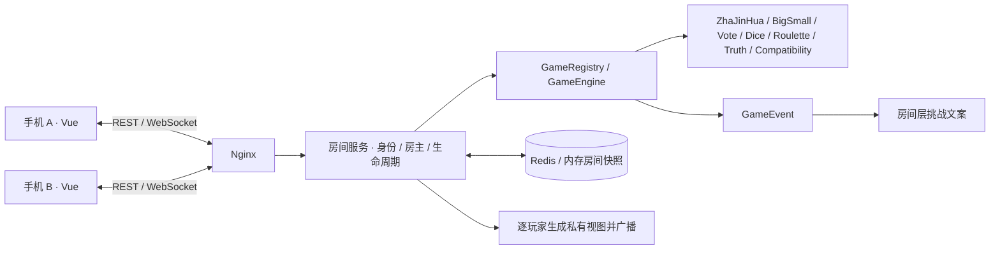

# 开发与部署

本文包含酒玩的部署、本地开发、架构与接口说明。项目介绍和玩法概览见 [README](../README.md)。

部署章节：[从源码构建](#从源码构建) · [更新与回退](#更新与回退) · [存储模式](#存储模式)。

## Docker 部署

需要 Docker Engine / Docker Desktop 与支持 `--wait` 的 Compose v2 或更新版本。根目录的 `docker-compose.yaml` 拉取 `latest` 前后端镜像，使用 Redis 保存房间。

发布镜像支持 **Linux AMD64（x86_64）**。ARM 设备、修改过源码或需要纯内存模式时，使用下文的 [源码构建配置](#从源码构建)。

在项目根目录执行：

```bash
docker compose up -d --wait --wait-timeout 180
```

首次启动会下载镜像，无需安装 Java、Node.js 或自行构建。完成后打开 **http://localhost:8088**。

```bash
docker compose ps                 # 三个服务应为 healthy
docker compose logs -f backend    # 后端日志
docker compose down              # 停止；保留 Redis 数据卷
```

### 部署配置

部署参数已直接写入根目录 `docker-compose.yaml`，无需创建 `.env` 文件。需要修改端口、镜像版本或来源地址时，编辑该文件中的对应配置：

| 配置位置 | 默认值 | 作用 |
| --- | --- | --- |
| `services.backend.image` | `docker.io/deng278/jiuwan-backend:latest` | 后端镜像地址与标签 |
| `services.frontend.image` | `docker.io/deng278/jiuwan-frontend:latest` | 前端镜像地址与标签 |
| `services.frontend.ports` | `8088:80` | 网站在宿主机上的访问端口为 8088 |
| `services.backend.environment.ALLOWED_ORIGINS` | `http://localhost:8088,http://127.0.0.1:8088` | 额外允许的跨域来源，逗号分隔 |

发布镜像已完成构建，根目录配置只使用 `image`。本地代码修改需要使用源码构建配置才会进入镜像。

### 更新与回退

先记录当前镜像版本并保留现有配置。保持 `latest` 标签可拉取更新；需要指定版本时，在根目录 `docker-compose.yaml` 中将前后端 `image` 的标签同时改为相同的已发布版本，例如 `v0.1.0`。然后执行下面一组命令；任何一步失败都会停止后续操作：

```bash
docker compose pull backend frontend &&
docker compose up -d --no-build --wait --wait-timeout 180 redis backend &&
docker compose up -d --no-build --no-deps --force-recreate --wait --wait-timeout 60 frontend
```

后端健康后重新创建前端，使 Nginx 解析更新后的后端地址。更新期间连接会短暂中断，完成后检查服务健康状态，并通过浏览器验证游戏和重连。

回退时，将前后端 `image` 的标签同时改回上一成功版本，并使用相应的部署配置执行同一组命令。回退只切换应用镜像，不会还原 Redis 数据，旧版本须能读取当前数据格式。

项目名固定为 `jiuwan`，Redis 数据卷为 `jiuwan_redis-data`。已有部署继续使用原项目名和数据卷；停止或更新时不要加 `down -v`，以免删除房间数据。

## 从源码构建

源码构建配置位于 `docker/`，Dockerfile 保留在 `backend/` 和 `frontend/` 中。它们使用本机默认架构构建，不依赖已发布的应用镜像。首次构建会下载 Java、Node、Maven 依赖。

从项目根目录进入 `docker/`，构建并启动 Redis 模式：

```bash
cd docker
docker compose -f docker-compose.build.yaml up -d --build --wait --wait-timeout 180
```

需要定制构建运行配置时，在 `docker/` 中复制 `.env.example` 为 `.env`，再编辑端口、来源或内存容量。源码构建使用 `docker/.env`。若从项目根目录调用构建配置，通过 `--env-file docker/.env` 明确指定构建环境文件。

后续管理也在 `docker/` 中使用同一配置：

```bash
docker compose -f docker-compose.build.yaml ps
docker compose -f docker-compose.build.yaml logs -f backend
docker compose -f docker-compose.build.yaml down
```

修改源码后再次执行带 `--build` 的启动命令。已有的源码构建部署也通过这份配置管理。

### 存储模式

| 模式 | Docker 服务 | 后端重启后 | 适用场景 |
| --- | --- | --- | --- |
| `redis`（默认） | 前端、后端、Redis | 可从 Redis 快照恢复未过期房间 | 长期运行 |
| `memory` | 前端、后端 | 所有房间、身份及本局状态清空 | 临时聚会、本地开发 |

无 Redis 的源码构建使用独立 Compose 文件，**不与其他文件叠加**。在 `docker/` 目录执行：

```bash
docker compose -f docker-compose.build.memory.yaml up -d --build --wait --wait-timeout 180
docker compose -f docker-compose.build.memory.yaml ps              # 两个服务应为 healthy
docker compose -f docker-compose.build.memory.yaml logs -f backend
docker compose -f docker-compose.build.memory.yaml down
```

两种模式使用相同的访问端口和游戏协议，均支持后端持续运行期间的页面刷新与断网重连。内存模式不会创建 Redis 客户端，也不会执行 Redis 健康探测。Redis 模式连接失败时仍报错，不自动切换为内存。

这些配置使用相同项目名和网站端口，不能在同一项目中同时启动两种模式。切换时，先用**原来的 Compose 文件**执行 `down`，再启动目标配置。例如从默认镜像部署切换到内存源码构建，以下命令从项目根目录执行：

```bash
docker compose down &&
cd docker &&
docker compose -f docker-compose.build.memory.yaml up -d --build --wait --wait-timeout 180
```

切换会断开当前连接，**两种存储之间不迁移房间数据**。`down` 不加 `-v` 会保留 Redis 数据卷；切回 Redis 时可能恢复其中尚未过期的旧房间。内存模式停止后，原内存房间无法恢复。

直接运行 Java / Maven 时用 `STORAGE_MODE=memory` 或 `STORAGE_MODE=redis` 选择，默认 `redis`；也支持 Spring 属性 `jiuwan.storage.mode`。不支持的模式值会使启动失败。Docker 的模式由所选 Compose 文件固定，修改 `.env` 中的 `STORAGE_MODE` 不会切换 Compose 服务。

内存模式默认最多保存 **1000 个未过期房间**（包括关闭后保留的房间），可用环境变量 `MEMORY_MAX_ROOMS` 或 Spring 属性 `jiuwan.storage.memory-max-rooms` 配置正整数。Docker 源码构建可在 `docker/.env` 中设置 `MEMORY_MAX_ROOMS=500`。达到上限时拒绝新建，返回 HTTP 503 / `SERVICE_UNAVAILABLE`，已有房间仍可继续操作，不会被驱逐。此上限控制房间数，不代表固定内存字节数。

## 两台手机一起玩

1. 手机和运行项目的电脑连接同一个 Wi-Fi。
2. 查看电脑局域网 IP，例如 `192.168.1.23`。
3. 两部手机都打开 `http://192.168.1.23:8088`，允许系统防火墙访问 8088 端口。
4. A 创建房间，填写昵称并进入；B 输入房间码加入。
5. A 选择游戏并开始，双方自动进入同一局。刷新或恢复网络后会重连。

**OrbStack 仅开放 localhost 的情况：** 如果电脑能访问 localhost，但 Wi-Fi IP 连接被拒绝，可在项目根目录另开终端运行项目自带的局域网入口：

```bash
LAN_HOST=192.168.1.23 node scripts/lan-proxy.mjs
```

把 IP 替换为本机 Wi-Fi 地址（macOS 可用 `ipconfig getifaddr en0` 查看）。该进程只将「酒玩」的 8088 端口从指定 Wi-Fi 地址转发到本机容器入口，支持 HTTP 和 WebSocket；需要持续运行，Ctrl+C 停止。自定义端口时同时设置 `FRONTEND_PORT`。

Nginx 转发原始 Host，WebSocket 支持同源访问，所以同一入口的局域网地址无需逐台加入白名单。跨域入口可用 `ALLOWED_ORIGINS` 指定，逗号分隔，不使用通配符。手机通过 HTTP 开发环境也能生成请求 ID、复制邀请信息；安装 PWA / Service Worker 需要 HTTPS 或 localhost。

默认网站端口为 8088。根目录镜像部署不向宿主机暴露后端和 Redis；源码构建的 Redis 模式额外提供本机调试端口 `127.0.0.1:16379`，后端仍不向宿主机暴露端口。镜像部署直接编辑根目录 `docker-compose.yaml`；源码构建通过 `docker/.env` 调整配置。公网使用时可在入口接入 HTTPS。

## 技术架构

- 前端：Vue 3、TypeScript strict、Vite、Pinia、Vue Router、Tailwind CSS、原生 WebSocket；无大型 UI 框架。
- 后端：Java 21、Spring Boot 3.5.16、Spring Web / WebSocket / Data Redis、Jackson、Lombok、Maven。
- 状态：服务端权威计算，Redis 或进程内存保存整个房间快照。前端只发操作。
- 部署：Nginx + 单实例 Spring Boot，Redis 7.4 可选，前后端同源代理。
- 游戏：Spring 自动注入 `List<GameEngine>`，`GameRegistry` 自动发现策略；前端按目录自动懒加载游戏组件。



## 目录结构

```text
jiuwan/
├── frontend/
│   ├── src/
│   │   ├── views/           首页、加入、昵称、大厅
│   │   ├── components/      游戏容器、玩家选择、弹窗、视觉组件
│   │   ├── stores/          user / room / game / websocket
│   │   ├── games/           每个游戏的 Game.vue、catalog、自动注册
│   │   └── lib/             类型、REST 请求、操作辅助
│   ├── public/              图标、manifest、离线页与 Service Worker
│   ├── tests/               Playwright 多人端到端测试
│   ├── nginx.conf
│   └── Dockerfile
├── backend/
│   ├── src/main/java/com/jiuwan/
│   │   ├── domain/          Room / Player / RoomSettings
│   │   ├── dto/             API / WebSocket 请求与安全的 RoomView
│   │   ├── controller/      REST 路由、统一异常处理
│   │   ├── service/         房间、身份、游戏编排、事件展示、定时维护
│   │   ├── game/            引擎接口、上下文、注册表、游戏状态与事件
│   │   │   └── impl/        七个引擎实现
│   │   ├── websocket/       连接绑定、鉴权、心跳、广播
│   │   ├── repository/      Redis / 内存快照读写
│   │   └── config/          WebSocket 来源限制、请求限速
│   ├── src/main/resources/questions/   JSON 题库
│   ├── src/test/            后端业务测试
│   └── Dockerfile
├── docs/                    开发部署、游戏规则、协议与验证记录
├── scripts/                 真实协议检查、可选的局域网入口
├── docker/
│   ├── docker-compose.build.yaml         从源码构建，Redis 模式
│   ├── docker-compose.build.memory.yaml  从源码构建，内存模式
│   └── .env.example                      源码构建配置样例
├── docker-compose.yaml      拉取发布镜像，Redis 模式
└── README.md
```

## 本地开发

需要 **JDK 21、Maven 3.9+、Node.js 22.12+（或 Node 24）、npm**；用 Docker 启动 Redis 时另需 Docker。内存模式的本地开发无需 Docker。

### 1. 启动 Redis（内存模式跳过）

```bash
docker compose --env-file docker/.env.example -f docker/docker-compose.build.yaml up -d redis
```

以上命令在项目根目录执行，使用构建配置中的本机 Redis 调试端口。若已创建并修改 `docker/.env`，将 `--env-file` 的值换成 `docker/.env`，后端的 `REDIS_PORT` 也使用对应端口。

### 2. 启动后端

确认 `java -version` / `mvn -version` 使用 Java 21。在独立终端运行：

```bash
cd backend
REDIS_PORT=16379 mvn spring-boot:run
```

后端监听 `http://localhost:8080`，健康检查 `http://localhost:8080/actuator/health`。

若使用自己的 Redis，可设置 `REDIS_HOST` 和 `REDIS_PORT`。请避免开发后端和 Docker 后端同时连接同一份 Redis 数据。

无需 Redis 的内存模式，在 `backend` 目录执行：

```bash
STORAGE_MODE=memory mvn spring-boot:run
```

运行打包后的后端也可使用 `STORAGE_MODE=memory java -jar target/jiuwan-0.1.0.jar`。端口及前端代理配置保持相同。

### 3. 启动前端

```bash
cd frontend
npm ci
npm run dev
```

打开 `http://localhost:5173`。Vite 监听所有网卡，`/api` 和 `/ws` 代理至本机 8080，手机可通过电脑 IP 的 5173 端口访问。

### 4. 构建和测试

```bash
cd backend
mvn test
mvn package

cd ../frontend
npm run build
npx playwright install chromium
npm run test:e2e
```

端到端测试要求后端、Vite 已启动；只有 Redis 模式需要启动 Redis。验证 Docker 生产入口（两种存储模式均可）：

```bash
cd frontend
E2E_BASE_URL=http://localhost:8088 npm run test:e2e
```

后端测试覆盖房间创建 / 加入 / 容量、身份伪造、房主权限与转移、断线恢复、并发重复操作、陈旧局次、插件注册、投票保密与并列、超时结算、骰子两种规则、默契分、轮盘与真心话权限、题库数量，以及两款牌类游戏的发牌、个人视图和回合流程。浏览器测试使用两个或三个独立上下文，覆盖七款游戏、刷新、网络断开恢复、房主转移，以及 375 / 390 / 430 / 1440px 布局。

## 核心设计决策

### 房间与身份

- 创建房间先预留昵称“派对发起人”与玩家身份，再进入昵称页面；未完成昵称也可凭原身份刷新恢复。
- `playerId` 与 WebSocket session 无关。服务端生成 256-bit 随机 `playerToken`，浏览器存入 `localStorage`，服务端存储只保存 SHA-256 摘要。
- Token 仅通过 REST 返回一次和 WebSocket `RECONNECT` 消息传输，不放在 URL、广播或日志中。
- 一个玩家同一时间使用一个活动连接；新连接替换旧连接，旧页面会明确显示提示。不同玩家应使用不同设备、浏览器或独立浏览器上下文。
- 昵称 1–16 字符，Emoji 固定白名单；房间容量默认 12，房主可设置 2–20。
- 进行中不接纳新身份加入；原身份可随时重连。明确退出或踢人会中止当前游戏并返回大厅，防止游戏等待已离场参与者。
- 正常离开即转移房主；断线保留 15 秒宽限，超时转给最早加入的在线玩家。无在线成员时保留待恢复的房主。
- `WAITING → PLAYING → FINISHED`，结束后可在同一房间继续开始任意游戏；关闭后 `CLOSED`。每轮拥有独立 `instanceId`。

### 权威状态、幂等与保密

`GameEngine` 接收操作，生成状态与事件。随机源使用服务端 `SecureRandom`。投票只在全部投完或 45 秒到期后公布统计；骰子 / 默契测试等限时 60 秒。开始前统一 3 秒倒计时，服务器拒绝提前提交。已过截止时间的操作也会拒绝，后台维护器负责结算。

大的喝小的喝使用 `deadline: 0` 表示不限时，动作校验和后台维护器均跳过截止时间检查。只有当前房主的 `END_ROUND` 才会结束本轮并亮牌，保持房间为 `PLAYING`，供下一局或返回大厅；该游戏不生成输赢、积分或挑战事件。

每个房间的变更在进程内锁下完成：读快照 → 鉴权 → 校验 → 修改 → 保存快照 → 广播。`requestId` 按玩家在房间内去重，最多保留最近 256 个；引擎额外阻止一位玩家重复操作。`gameId + instanceId` 拒绝旧游戏或旧局的延迟操作。状态 `version` 单调递增，前端忽略旧版本。版本可能跳号（例如心跳更新），客户端接收的是完整快照，不依赖增量消息。

私有 `privateChoices` 从不直接序列化给客户端。`getPlayerView` 只加上当前玩家的 `myChoice` / `hasActed`。投票结束也不会泄露投票者对应关系，除非房间主动关闭匿名投票。默契测试若只有一个答案而超时，取消该轮并保持答案私密。炸金花的 `ZhaJinHuaState` 只保存在服务端。看牌前，自己的手牌也不会下发；看牌后只通过个人视图发送。结束时只公开未弃牌者的手牌，弃牌者的牌始终对他人保密。

大的喝小的喝将完整发牌结果保存在 `GameState.bigSmall`，不使用会回传 `myChoice` 的 `privateChoices`。每轮从 52 张牌中随机、不重复地给每位在线玩家发 1 张，按本轮参与者顺序展示。结束前个人视图只包含其他参与者的牌，本人座位省略 `card`；公共视图和未参与本轮的身份不展示任何牌面。结束后所有视图公开全部牌。刷新、Redis 恢复及重连沿用同一份发牌结果；每轮重新洗牌，允许与上一轮偶然发到相同牌。

### 事件与挑战分离

引擎只生成 `GameEvent`（胜者、败者、选中玩家、挑战玩家、全体玩家等）。`GameEventPresenter` 根据 `RoomSettings.punishmentMode` 生成“自选挑战 / 真心话 / 自选小任务”文案。引擎只记录酒局规则开关，饮酒文案仍由展示层生成。炸金花每局输家统一为 1 小口，虚拟积分不映射饮酒量。

默认安全模式开启，题库保持轻松。炸金花默认酒局模式：每位输家 1 小口，可换饮料或跳过；可在房间设置单独关闭酒局模式，改用房间挑战方式。大的喝小的喝只负责发牌和亮牌，其余游戏仍使用原挑战方式。所有挑战都可自愿跳过，由房主开始下一局。

### 房间存储与运行边界

两种模式都通过 `RoomRepository` 保存完整 Room（含玩家、令牌摘要、设置、私有游戏状态、事件、去重记录）。Redis 使用单个键 `jiuwan:room:{roomCode}`，一次 `SET` 原子提交完整状态。内存使用独立的 JSON 快照，读写对象与已提交状态隔离，操作校验失败不会泄露部分修改。两种实现共用序列化和过期规则。房间人数很少，鉴权在最多 20 人中查找摘要，第一版无需额外 Token 索引。

- 未关闭房间 TTL 6 小时，合法操作 / 心跳刷新 TTL。
- 关闭后保留 15 分钟用于识别过期访问。
- 内存模式读到过期房间时立即删除，每分钟额外清理无人访问的过期快照；新建房间达到容量上限时先清理过期项。
- 所有人离线 30 分钟后自动关闭；连接超过 65 秒未发心跳视为离线。
- Redis AOF 持久化与命名数据卷；启动时用 `SCAN` 恢复未关闭房间，将所有玩家标记离线，等待各自重新鉴权，保留本局状态。
- 内存模式重启后从空存储开始，旧房间访问返回 `ROOM_NOT_FOUND`，需要重新建房。
- 单实例适合 MVP。**不能直接水平扩容多个后端共享同一份房间键**：扩容需要房间分区 / 分布式事务与 Redis Pub/Sub 广播。当前部署明确只启一个后端。
- Redis 设置 256 MB 上限与 `noeviction`，容量满时显式报错，不静默驱逐进行中的房间。

### 网络与移动体验

WebSocket 心跳每 20 秒一次；1 / 2 / 4 / 8 / 10 秒指数退避自动重连，成功后发送 `RECONNECT` 并恢复完整房间及个人视图。支持 `online`、`offline`、`visibilitychange`，用于锁屏、切后台和网络切换。等待中的操作若断线会提示检查最新状态，不会盲目重放。

提供移动大按钮、Emoji 头像、加入过渡、投票结果动画、骰子动画、按服务器索引定位的轮盘动画、排行榜动画，并遵从减少动态效果的系统偏好。首次开局或切换游戏时显示 3 秒倒计时；连续两局为同一游戏时直接开始，返回大厅后重开同一游戏也跳过倒计时。游戏组件懒加载。

PWA 使用 manifest、图标与离线提示页；动态 API、身份与游戏状态不写入 Service Worker 缓存。离线时不能继续计算游戏结果，恢复网络后重连。当前二维码入口按需求预留，第一版可复制链接或房间码邀请。

## REST API

统一成功响应：`{ "success": true, "data": ... }`。
统一失败响应：`{ "success": false, "error": { "code": "...", "message": "..." } }`。

| 方法 | 路径 | 请求 / 身份 | 返回 |
|---|---|---|---|
| POST | `/api/rooms` | `{ nickname, avatar }` | `roomCode, playerId, playerToken` |
| POST | `/api/rooms/{code}/join` | `{ nickname, avatar }` | 同上 |
| GET | `/api/rooms/{code}` | 无身份 | 仅房间状态 / 人数 / 容量 |
| GET | `/api/rooms/{code}` | `Authorization: Bearer <token>` | 当前玩家安全视图 |
| GET | `/api/games` | 无身份 | 已注册游戏列表 |
| POST | `/api/rooms/{code}/games/{gameId}/start` | Bearer token + `{ requestId }`，房主 | 开始并返回快照 |
| GET | `/actuator/health` | 无身份 | 服务健康状态；Redis 模式额外检查 Redis |

房间设置、踢人、结束游戏和游戏动作统一走 WebSocket。REST 按来源 IP 每分钟最多 120 次；WebSocket 每连接每秒最多 20 条、单条最多 8 KB，未鉴权连接会清理。

## WebSocket 协议

端点 `/ws`。先恢复身份，再发送动作：

```json
{"type":"RECONNECT","requestId":"unique-id","roomCode":"123456","playerToken":"token-from-create-or-join"}
```

```json
{
  "type": "GAME_ACTION",
  "requestId": "unique-id",
  "roomCode": "123456",
  "playerId": "optional-consistency-check",
  "gameId": "vote",
  "instanceId": "instance-from-current-game-view",
  "action": "VOTE",
  "data": { "targetPlayerId": "player-id" }
}
```

服务器返回版本化的完整快照，每个连接按绑定身份单独生成：

```json
{
  "type": "GAME_STATE_UPDATE",
  "roomCode": "123456",
  "gameId": "vote",
  "version": 18,
  "serverTime": 1789455600000,
  "data": {
    "roomCode": "123456",
    "status": "PLAYING",
    "version": 18,
    "players": [],
    "settings": {},
    "game": {
      "gameId": "vote",
      "instanceId": "current-round-instance",
      "round": 1,
      "complete": false,
      "hasActed": false,
      "submittedCount": 0
    },
    "events": []
  }
}
```

上方为裁剪示例；完整字段、动作、ACK、错误和重连约定见 [WebSocket 协议](protocol.md)。

## 增加新游戏

以 `rock-paper-scissors` 为例：

1. 新建 `RockPaperScissorsGameEngine`，标注 `@Component`，实现 `GameEngine` 或继承 `AbstractGameEngine`。
2. 返回唯一 `gameId()` 与 `gameName()`；实现 `initialize` / `handleAction` / 超时处理。`AbstractGameEngine` 负责局次、倒计时、参与者快照与安全视图基础字段。
3. 私有选择放在 `GameState.privateChoices`；公开内容放在 `publicData`。不要把私有字段拷贝到公开视图。更复杂的牌类游戏可扩展独立的服务端状态类型和私有视图。
4. 引擎通过 `GameEvent` 报告结果。插件不会直接修改房主、成员或发送饮酒指令。
5. 新建 `frontend/src/games/rock-paper-scissors/Game.vue`，使用 `useGameStore` 读个人视图、`useAction` 发操作。
6. 在 `frontend/src/games/catalog.ts` 加一条卡片描述（新增界面字段时扩展 `GameView` 类型）。前端 `registry.ts` 自动发现对应目录，无需改路由或大厅渲染代码。
7. 添加引擎测试，运行后端测试和前端构建。

Spring `GameRegistry` 自动收集 Bean，重复 ID 会在启动时失败。无需修改核心服务的 `switch` 来增加普通游戏动作。

## 验证与代码格式

已有验证记录与运行边界见 [验证记录](verification.md)。生产入口可在项目根目录执行 `node scripts/protocol-smoke.mjs`，验证权限、私密视图和重连。

前端代码格式：`cd frontend && npm run format:check`（修改后可执行 `npm run format`）。
